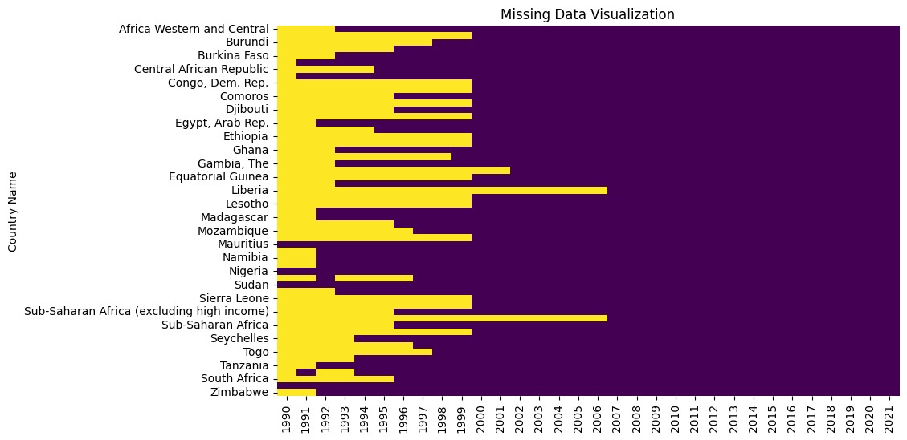
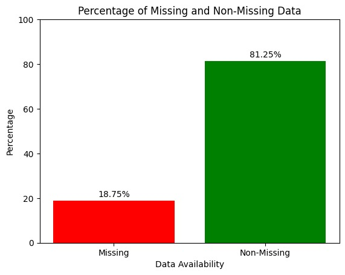
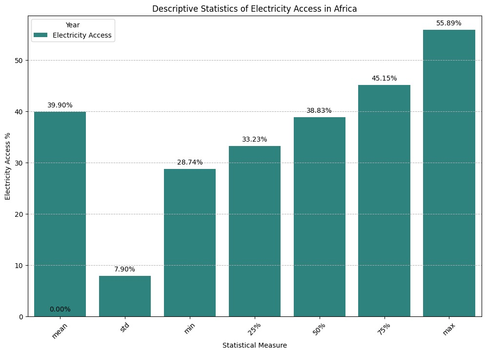
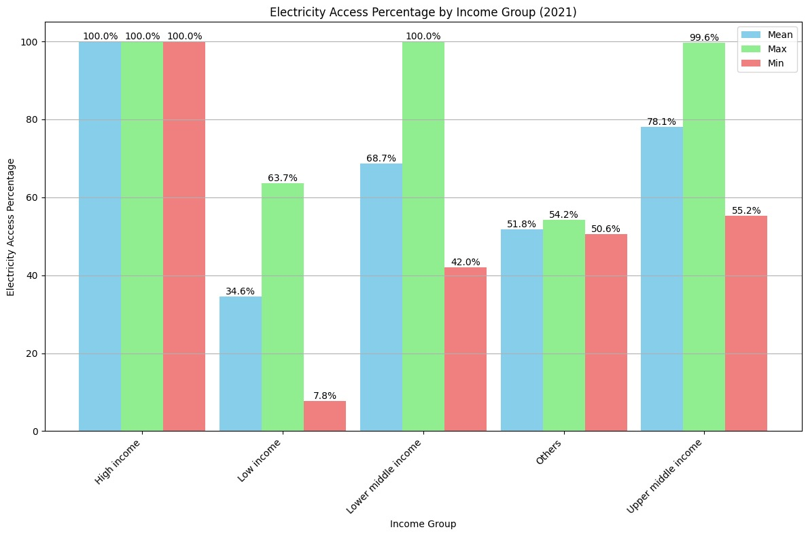
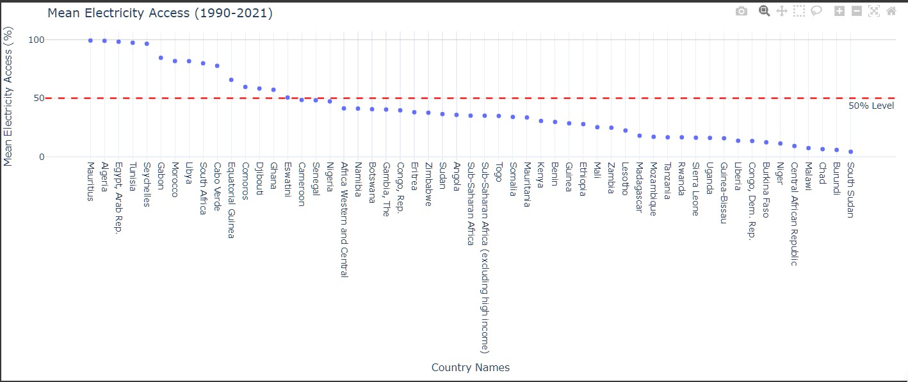
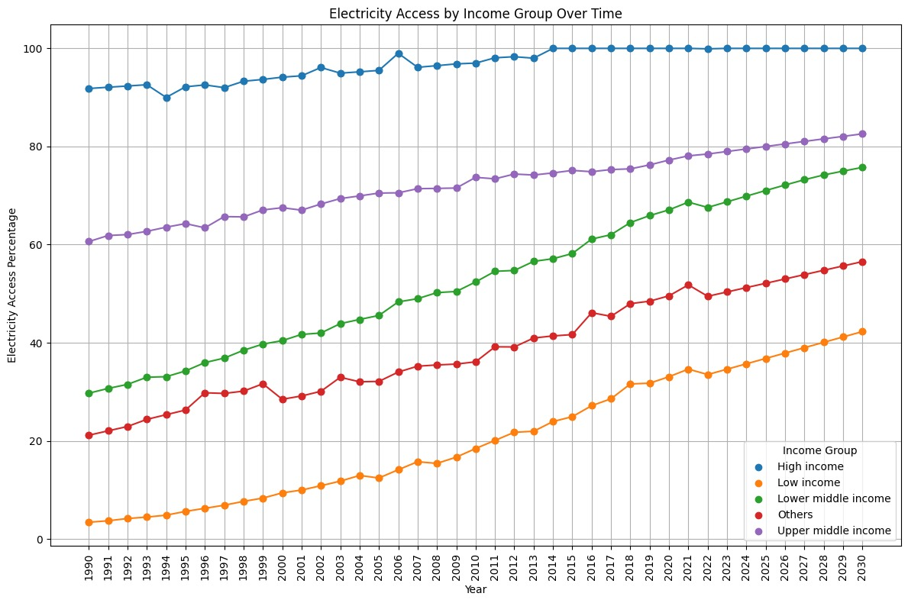
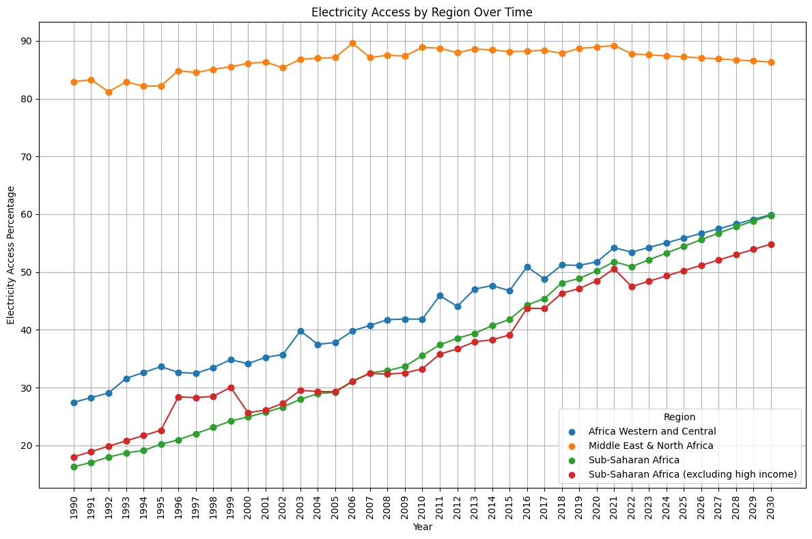
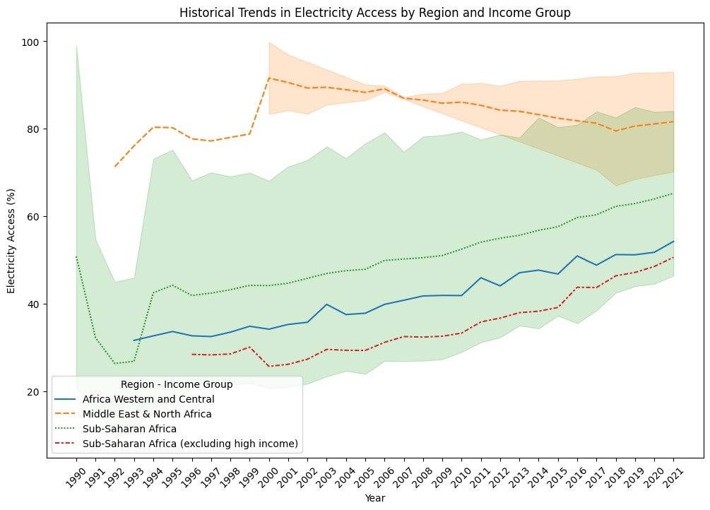
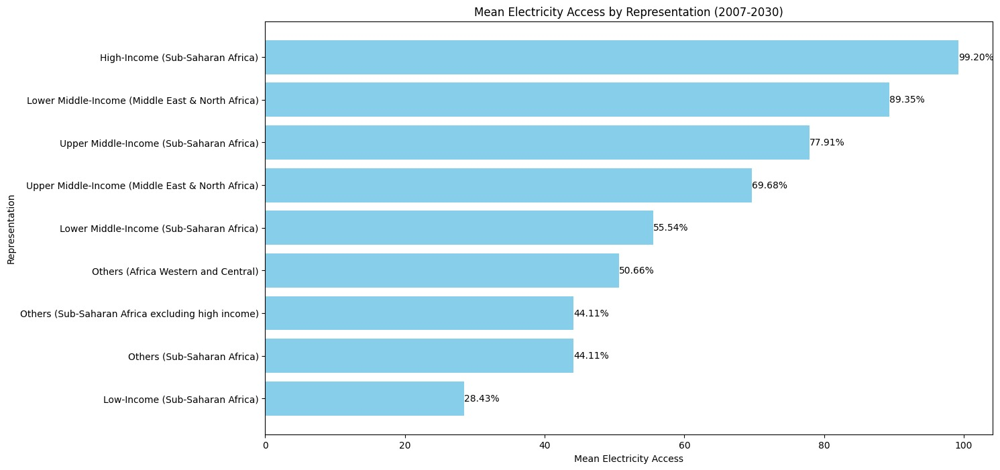
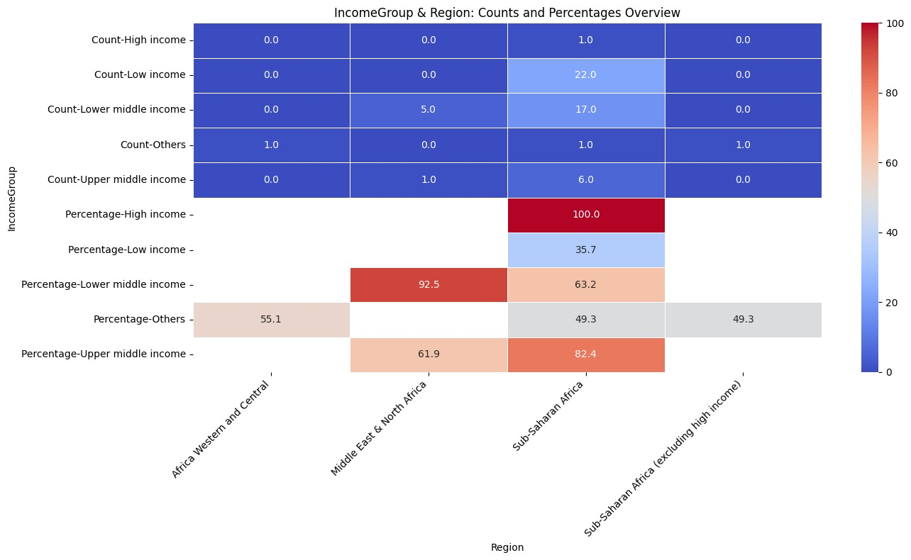

# Predictive Modeling of Electricity Access in Africa 

## Project Overview
Access to electricity is vital for economic development and societal well-being. Nations with reliable
electricity tend to exhibit higher productivity, an improved standard of living, and enhanced
competitiveness in the global market. Electricity plays a crucial role across various sectors, including
agriculture, education, and healthcare, ensuring their efficient operations. This research endeavours to
analyze data from 1990 to 2021 to discern patterns and trends in electricity access across African countries.
Leveraging regional and income data, alongside predictive modelling techniques, our goal is to offer
insights that can guide policy decisions and interventions aimed at understanding electricity access in the
region.

According to data analysis and projections from the International Energy Agency (IEA), approximately 110
million new connections are required annually starting in 2022. However, given the current pace observed
in recent years, this target remains significantly off track (IEA, 2023). (https://www.iea.org/reports/sdg7-
data-and-projections). The idea of this project is to analyze and track the trend of electricity access in Africa
and attempt to develop predictive modelling of electricity access in Africa to identify significant statistical
relationships and differences through the forecast and trends.

## Problem Statement

The problem that this study addresses revolves around the persistent challenge of low electricity access in 
various African countries.
If this issue remains unaddressed, it could have severe consequences, impacting millions of people and 
impeding socio-economic development in these countries. The lack of electricity access hinders progress 
towards achieving the United Nations' Sustainable Development Goals (SDGs) of promoting inclusive and 
sustainable economic growth.
To effectively tackle this challenge, robust forecasting techniques like the ARIMA model need to be utilized 
to project electricity access levels until 2030. This approach aligns with the recommendations of scholars 
like Ma et al. (2019), who advocate for extended-duration forecasting models to address the complexities of 
energy access planning in African countries.

## Objectives:
    
   + Analyze historical trends in electricity access across African countries relative to region and
income.

   + Identify similarities, differences, and patterns in electricity access among African countries.
    
   + Develop predictive models to forecast future electricity access levels based on regional and
income data.

   + Provide valuable analysis to inform targeted interventions for understanding electricity access
in Africa.

# Methodology

## Research and Data Collection
   Datasets: The data for this project was gotten from the World Bank data on Access to electricity - https://data.worldbank.org/indicator/EG.ELC.ACCS.ZS

## Data Pre-processing

Data preprocessing was done on the data to clean and transform the data for analysis.

  + Data Cleaning: The plot below is a visual representation of the extent of missing values. The Ridge (linear regression) was used to fill in the missing values. This is because, we evaluated the dataset to ascertain it type(s) of value missingness, and the options that best suits it. Ridge regression was a better option for the missing values and therefore, was used in filling of the missing values.

+ Data Availability
  

## Exploratory Data Analysis

 + Descriptive Statistics of Electricity Access in Africa 

+ Electricity Access Percentage by Income Group

 + Mean Electricity Access (1990-2021)
    

## Electricity Access in Africa 
 + Electricity Access by Income Group
   

 The graph  shows the progress of electricity access across different income groups from 1990 to 2020.

High Income : This group has maintained nearly 100% access throughout the 30-year span, indicating stable and consistent electricity availability.

Upper Middle Income : Starting with lower access rates, this group has seen a substantial increase, nearing complete access by 2020.

Lower Middle Income :  Similar to the upper middle income, there's been a significant improvement in access over time.

Low Income : Although they began with very limited access, the low-income group has shown considerable progress, with a clear upward trend in the graph.

Overall, the graph illustrates a positive trend where all income groups have improved their electricity access over the past three decades, with high and upper middle-income groups achieving near-universal access by 2020. The most notable progress is seen in the low-income group, which, despite starting from a low base, has made significant strides towards better electricity access. This reflects the ongoing efforts and investments in infrastructure to bridge the energy gap between different socioeconomic classes.

+ Electricity Access by Region

  

The graph above shows the progression of electricity access in various regions from 1990 to 2020.

Africa Western and Central (Orange Line): This region’s electricity access has been relatively stable, hovering around 80-90% throughout the period.
Middle East & North Africa (Blue Line): Starting at around 70% in 1990, there’s been a steady climb in electricity access, reaching close to 90% by 2020.
Sub-Saharan Africa (Red Line): There’s a notable increase in this region, with access rising from below 20% to about 40%.
Sub-Saharan Africa (excluding high income) (Green Line): This line shows significant growth, starting from below 20% and surpassing the 60% mark by 2020.
Overall, the graph indicates that while there has been an improvement in electricity access across all regions, Sub-Saharan Africa (excluding high income) has seen the most substantial growth. However, it still has the lowest access rate compared to the other regions depicted. The Middle East & North Africa region maintains the highest rate of electricity access, consistently above 80% since 1990. The data/graph    suggests a positive trend towards increasing electricity access, which is crucial for development and quality of life.

# Historical Trends Analysis 

Analyzing the trends in electricity access across different regions and income groups in Africa, we can observe a dynamic yet challenging landscape. The line graph above depicts electricity access spanning  1990 to 2021. It is a visual representation of the progress and disparities in electrification in Africa.

Africa Western and Central (green solid line) shows a commendable steady increase in electricity access. This suggests that initiatives and investments in infrastructure have begun to pay off in that region, although the starting point was quite low. The consistent upward trajectory indicates that more households (percentage of population) are experiencing the benefits of electricity access which can lead to improved quality of life and economic development.

Middle East & North Africa*(red dashed line), with a higher initial electricity access, continues to improve, albeit at a slower rate. This could be due to already having a relatively developed electrical grid, thus the marginal gains appear less dramatic compared to regions starting from a lower baseline.

*Sub-Saharan Africa (excluding high income) (blue dotted line) depicts a consistent rise in electricity access. However, it's evident that the overall levels of access are lower compared to the other regions. This highlights the ongoing struggle to provide electricity to all, especially in rural areas where the infrastructure may be lacking or non-existent.

The shaded areas between the lines suggest that there are overlaps in electricity access percentages among these groups, indicating that no single narrative can fully capture the diverse experiences of electrification across Africa.

However, while there is a clear overall trend of increasing electricity access in Africa, the pace and extent of progress vary widely. The data underscores the need for continued efforts to bridge the electrification gap, particularly in regions that are lagging behind. It also emphasizes the importance of tailored solutions that consider the unique challenges and opportunities within each region and income group. The goal remains to achieve universal electricity access, which is essential for social and economic development.

The data analysis, also reveals that there is a strong connection between electricity access and income group. Regions with high income tend to have higher percentage of electricity access.

 
## Similarities, Differences and Patterns

 + mean electricity access by income and region

This graph shows there is a correlation between income category and electricity access. For all regions, it the higher income groups that have access greater access to electricity.This is an indicative similarity or pattern.

-Higher Income, Higher Access: There's a clear trend where higher-income groups tend to have greater access to electricity. For instance, the high-Income group in Sub-Saharan Africa has the highest access at 99.20%.

-Regional Variations:  Different regions have varying levels of access, with the Middle East & North Africa generally having higher access than Sub-Saharan Africa for comparable income groups.

-Income Disparity:  There is a significant drop in electricity access as income levels decrease.

 The Low-Income group in Sub-Saharan Africa has the lowest access at just *28.43%*

This graph highlights the disparity in electricity access across different income levels and regions, reflecting the broader challenges of energy inequality. It's a powerful visual representation of how socioeconomic status can impact the quality of life, including basic utilities like electricity.

  + income group and region counts/percentage

## Machine Learning Model Development 

In this project, the dataset was used to build Ridge, Lasso and Linear regression models. This three models powers the Streamlit App, which makes prediction by taking the average of the predictions from the three models.

The dataset was also used to train ARIMA models for each country and the mean absolute error computed.

The results shows that some ARIMA models had low MAE. The results are included in a csv file in the file section of the repository.

## Model Deployment and Forecasting Electricity Access (2021-2030)
The models was deployed as a Streamlit App. Below is the link to the app: https://electricityaccess.streamlit.app/

To use the model for electricity access forecasting, first select a country by clicking the drop-down menu, and then select a lower band (year) and upper band(year) and the app automatically shows a visaulization of the  forecast.

 + The Streamlit App Interface

 + Example forecast for Burndi

# Results and Discussion
The dataset classified the population access to electricity based on income and demography (region). But data analysis of the trends reveals that in all regions people in the higher income bracket had more access to electricity. This could be tied to pricing and affordability by the higher income class. Higher income means higher electricity access.

The forecast also suggests, that access to electricity in Africa will continue to rise possibly because of the increase awareness and demand for more power geared towards industrialization.

It is important that government and agencies utilize the forecast to provision for more infrastructure to increase access to electricity.

